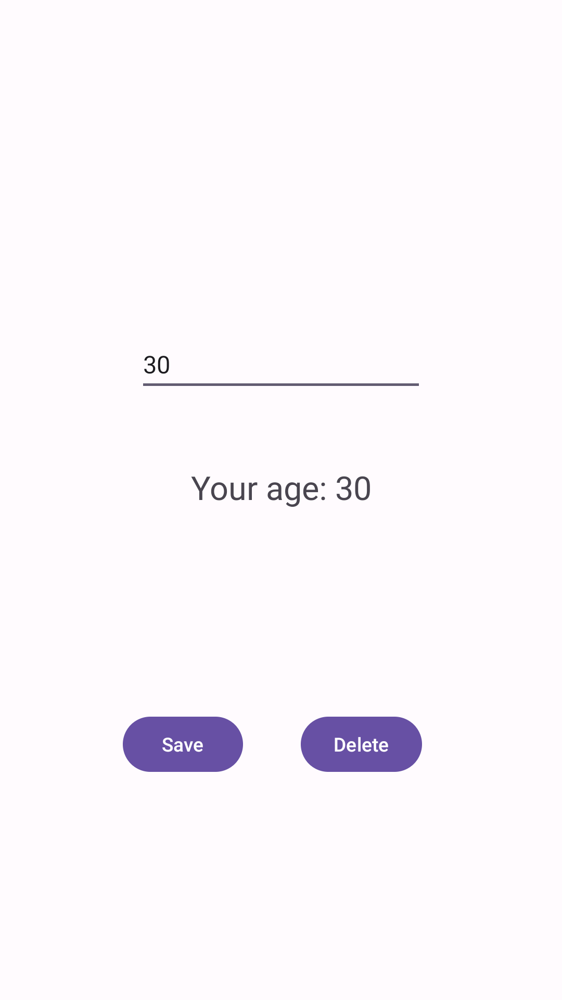

# StoringDataApp

This Android application is a simple app that allows the user to input and store their age using SharedPreferences. It provides functionality to save and delete the stored age information.

## Features

- Input and store user's age using SharedPreferences.
- Save and delete the stored age information.

## Usage

1. Clone the project to your computer or download it as a ZIP file.

    ```bash
    git clone https://github.com/josephnade/StoringDataApp.git
    cd storing-data-app
    ```

2. Open the project in Android Studio or another suitable Android development environment.

3. Run the application on an Android device or emulator.

4. Enter your age in the input field.

5. Press the "Save" button to save the entered age using SharedPreferences.

6. Press the "Delete" button to delete the last saved age.

## Screenshots



## Technologies

- Java
- Android Studio

## Data Storage

The app uses SharedPreferences for storing age information persistently.

## Contribution

Contributions and feedback are welcome. If you have questions or suggestions, please [contact us](mailto:yusuf.akn2017@gmail.com).

---

We hope this documentation helps you understand and use the StoringDataApp effectively. Happy storing! 📊
